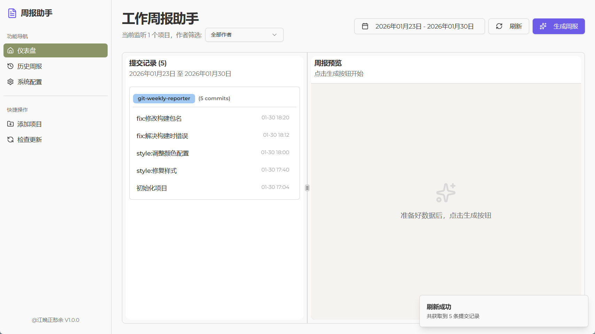
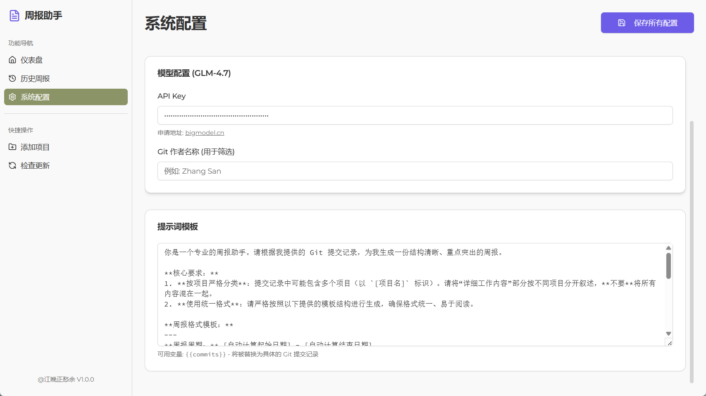
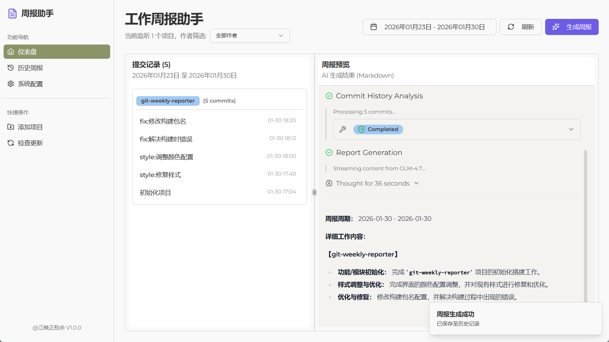
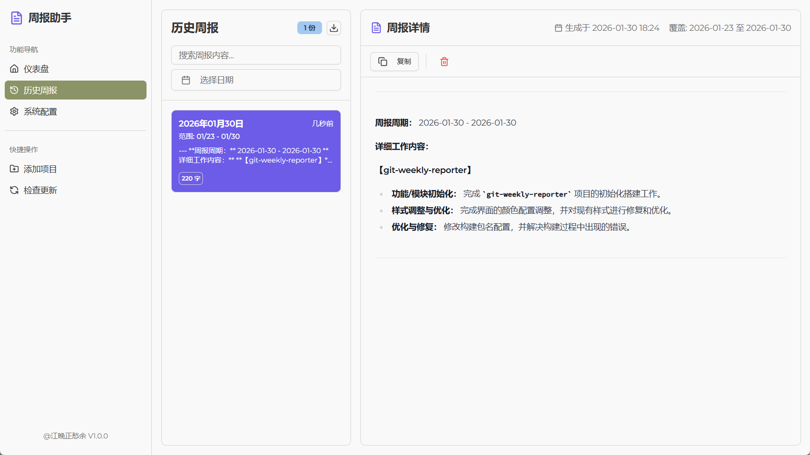

# Git Weekly Reporter - 项目目标文档

## 1. 项目概述

本项目旨在构建一个跨平台的桌面应用程序，用于帮助开发者自动收集、筛选并总结 Git 提交记录，生成周报。应用基于 Tauri 2.0 构建，采用 Next.js 作为前端框架，shadcn/ui 作为 UI 组件库。

## 2. 技术栈

- **Core**: Tauri 2.0 (Rust)
- **Frontend**: Next.js (React), TypeScript
- **UI**: shadcn/ui, Tailwind CSS
- **Data Fetching**: Rust `Command` (调用系统 git) 或 `git2` crate
- **State Management**: Zustand 或 React Context
- **AI Integration**: 智谱 GLM 接口用于生成总结

## 3. 核心功能模块

### 3.1 项目管理 (Project Management)

- **添加项目**: 用户可以通过文件选择器添加本地 Git 仓库路径。
- **项目列表**: 展示已添加的项目，支持删除操作。
- **持久化**: 项目列表需持久化存储（如 `tauri-plugin-store` 或本地 JSON）。

### 3.2 提交记录查询 (Commit Query)

- **时间筛选**:
  - 快捷筛选: 本周 (This Week), 上周 (Last Week), 本月 (This Month), 今日 (Today)。
  - 自定义范围: Date Picker 选择开始和结束日期。
- **作者筛选**: 自动识别或手动输入 Git Author Name。
- **多项目聚合**: 支持同时查询所有已添加项目的提交记录。

### 3.3 数据展示 (Data Display)

- **表格展示**: 使用 shadcn/ui `DataTable` 展示提交记录。
- **列定义**: 项目名, 提交哈希 (Hash), 作者, 时间, 提交信息 (Message)。
- **交互**: 支持按列排序、分页。

### 3.4 智能总结 (AI Summary)

- **提取**: 将筛选出的提交记录提取为纯文本格式。
- **总结**: 提供 "生成周报" 按钮，调用 AI 接口将零散的 commit message 总结为结构化的周报内容。

## 4. 实施路线图

### Phase 1: 基础架构搭建 (Current)

1. 初始化 Tauri 2.0 + Next.js 项目。
2. 配置 shadcn/ui 环境。
3. 实现 Rust 端 Git 命令调用接口。
4. 实现前端项目管理界面 (添加/列表)。

### Phase 2: 核心功能实现

1. 实现时间筛选逻辑 (Day.js)。
2. 集成 Data Table 展示 Git Log。
3. 联调 Rust 与前端的数据交互。

### Phase 3: 优化与 AI 集成

1. 接入 AI 总结接口。
2. UI/UX 优化 (Loading 状态, 错误处理)。
3. 打包发布。

## 5. 目录结构规范

```
src-tauri/
  ├── src/
  │   ├── lib.rs          # 核心逻辑
  │   └── main.rs         # 入口
  ├── capabilities/       # 权限配置
  └── tauri.conf.json     # Tauri 配置
app/
  ├── components/         # UI 组件
  ├── lib/                # 工具函数 (git.ts, utils.ts)
  ├── store/              # 状态管理
  └── page.tsx            # 主页面
```




