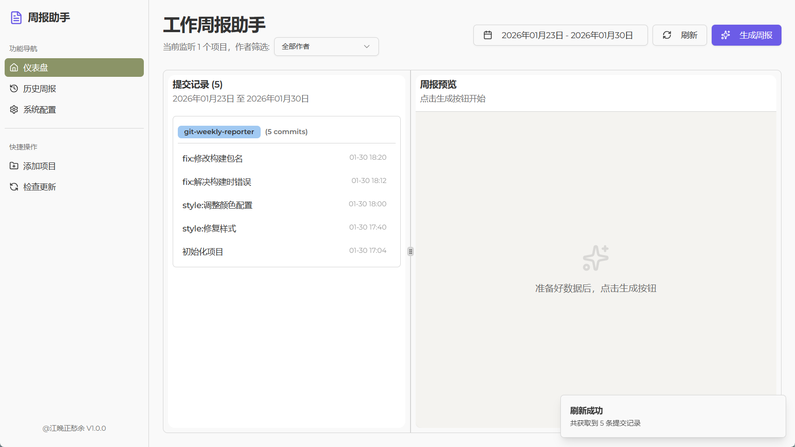
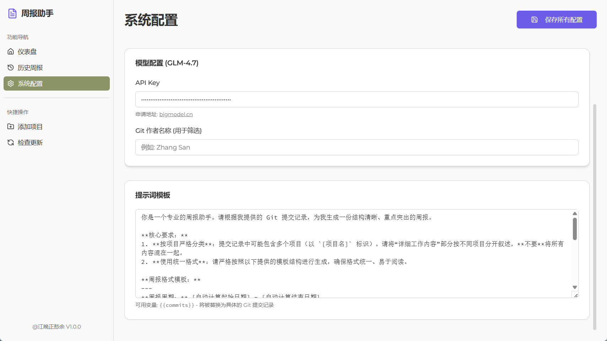
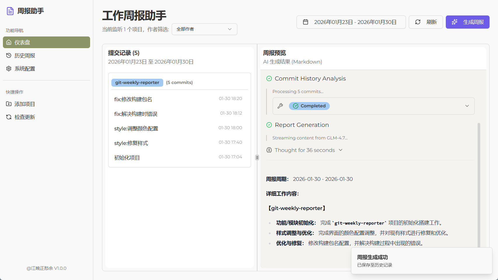
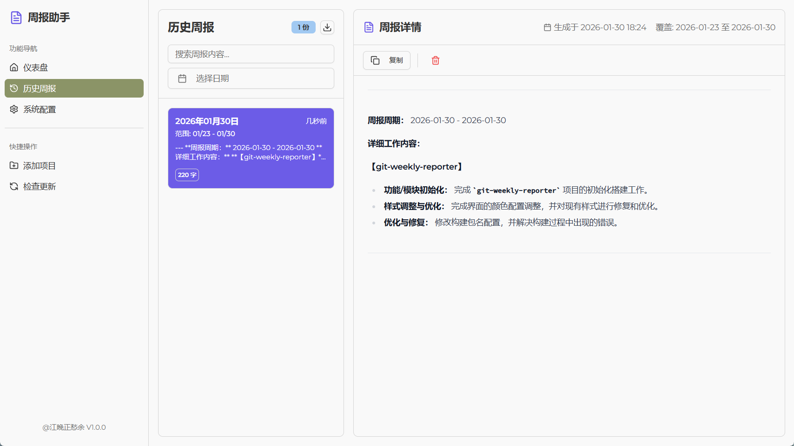

# Git Weekly Reporter

跨平台 AI 周报助手。应用会读取本地 Git 仓库提交记录，按项目聚合后调用大模型（智谱 GLM / MiniMax / 自定义 OpenAI 兼容厂商）生成结构化周报，并保留历史记录供检索和导出。

## 技术栈

- 桌面壳: Tauri 2
- 前端: Vite + React + TypeScript + React Router
- 状态管理: Zustand（`persist`）
- UI: shadcn/ui + Tailwind CSS
- Git 调用: `@tauri-apps/plugin-shell` 执行系统 `git`
- AI: 多提供商（智谱 GLM / MiniMax / 任意 OpenAI 兼容厂商），流式输出
- 同步: 可选 Notion 自动/手动同步

## 快速开始

```bash
pnpm install
```

### 本地开发（Web 模式）

```bash
pnpm dev
# 或
pnpm web:dev
```

说明:
- Web 模式下不访问本机 Git，`src/lib/git.ts` 会返回 mock 提交数据。
- 适合调 UI 和交互流程。

### 桌面开发（Tauri 模式）

```bash
pnpm tauri:dev
```

说明:
- 可选择本地仓库目录。
- 可调用系统 `git` 获取真实提交记录。
- 可使用更新检查、系统文件保存等桌面能力。

### 构建

```bash
pnpm build
pnpm preview
pnpm tauri:build
```

## 主要功能

- 项目管理: 添加/删除 Git 仓库路径，支持项目别名。
- 每项目抓取配置: 可分别设置分支范围（全部分支 / 当前分支 / 指定分支，默认全部分支以免漏提交）和作者范围（继承全局 / 全部 / 指定）。
- 提交聚合: 按日期范围过滤并合并多个项目提交；支持逐条勾选 / 项目级全选，仅勾选的提交参与生成。
- 多模型提供商: 内置智谱 GLM、MiniMax，并可添加任意 OpenAI 兼容厂商（自定义名称、协议、API Key、模型、完整请求地址）。
- AI 周报生成: 流式展示推理和正文，自动入库历史记录。默认提示词以资深负责人视角强调归纳成果、过滤噪音，避免提交多时变成逐条罗列的流水账；生成时自动注入各项目背景（README、package.json 等），并使背景中的项目名与提交前缀 `[项目名]` 对齐，帮助模型准确归类。
- 提示词自定义: 设置页可编辑提示词模板（变量 `{{commits}}`），并支持一键「恢复默认」应用最新内置提示词。
- Notion 同步: 生成后可自动或手动同步，支持追加正文 / 创建子页面两种方式；长周报会自动按 Notion 单次 100 块上限分批发送，完整同步不丢内容。
- 历史管理: 搜索、按日期过滤、复制纯文本、导出 JSON。
- 自动更新: 基于 Tauri updater + GitHub Releases。

## 核心数据流

1. 在设置页维护项目列表（含每项目分支/作者）、模型提供商、提示词模板、Notion 配置。
2. 仪表盘读取项目并拉取 Git 日志（每个项目按其配置独立查询，再合并排序）。
3. 勾选要纳入的提交，转换为带 `[项目名]` 前缀的提示词输入，并为涉及的项目注入背景上下文，调用当前生效的提供商流式生成周报。
4. 周报以 `Report` 结构落地到 Zustand 持久化存储，并可选同步到 Notion。
5. 历史页读取持久化数据，支持查看、检索和导出。

## 关键目录

```text
src/
  App.tsx                  # 路由入口与整体布局
  pages/
    Dashboard.tsx          # Git 拉取、提交勾选、AI 生成、结果预览
    Settings.tsx           # 项目管理 / 模型 / Notion / 提示词 / 关于 五个分页
    History.tsx            # 周报历史检索与导出
  lib/
    git.ts                 # Git 命令调用与解析（按项目分支/作者抓取、项目背景提取）
    glm.ts                 # 多提供商流式请求与回调（组装提交与项目背景为提示词）
  store/
    index.ts               # Zustand 持久化状态

src-tauri/
  src/lib.rs               # Tauri 命令注册（含 Notion 分批同步）
  tauri.conf.json          # 窗口、打包、updater 配置
  capabilities/default.json# 权限声明（git 执行、fs 写入等）
```

## 更新发布说明

- Updater 配置在 `src-tauri/tauri.conf.json`。
- 需要签名密钥，可运行:

```bash
pnpm updater:keys
```

- 更详细流程见 `docs/UPDATER_GUIDE.md`。

## 截图





