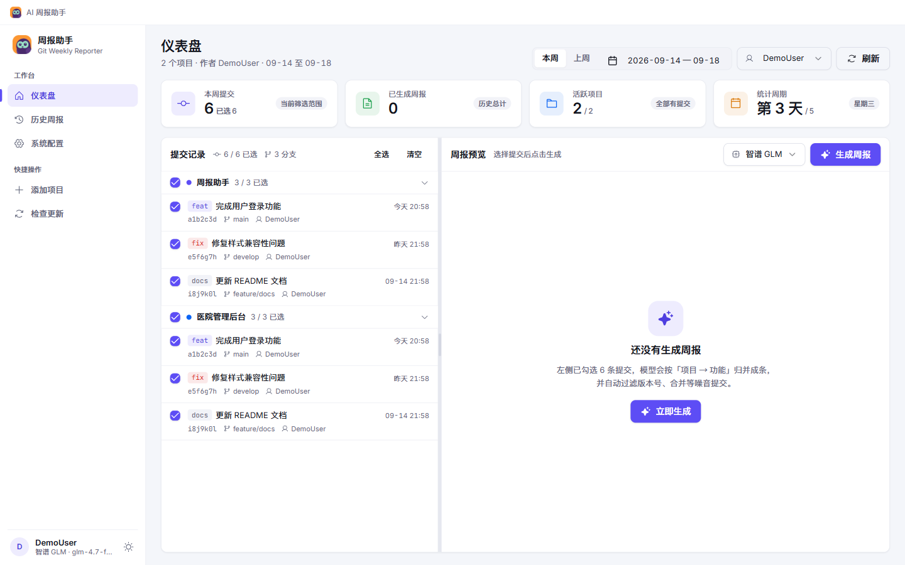
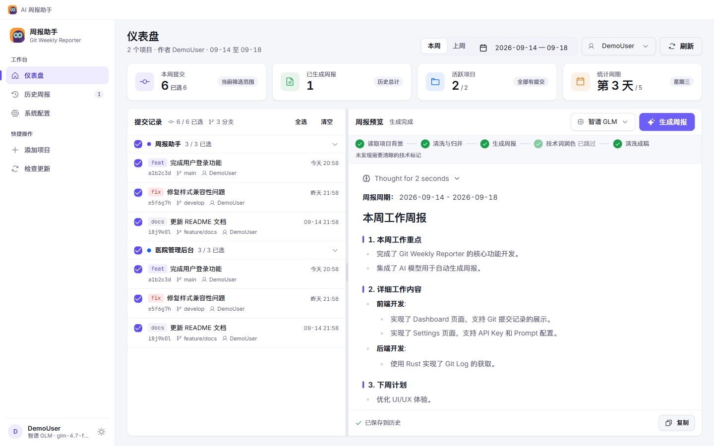
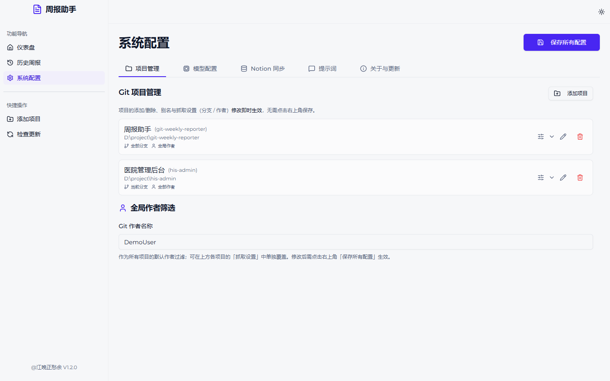
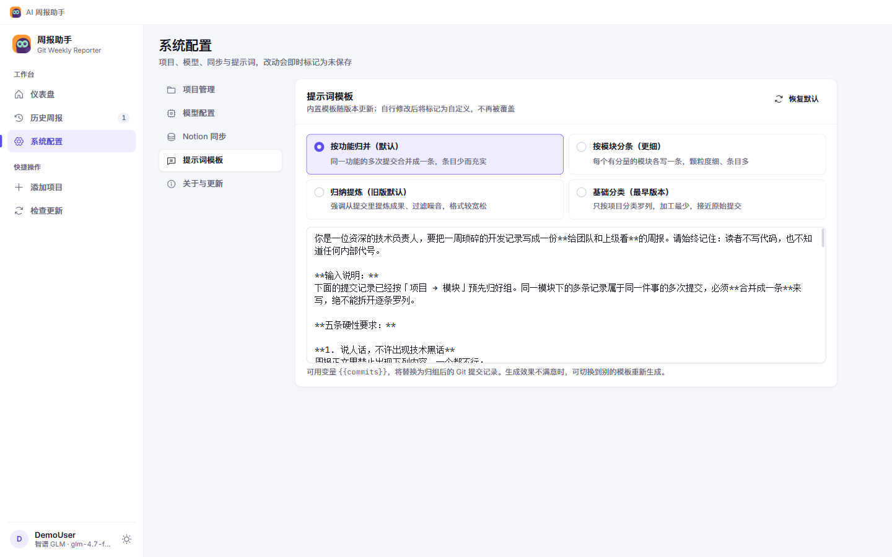
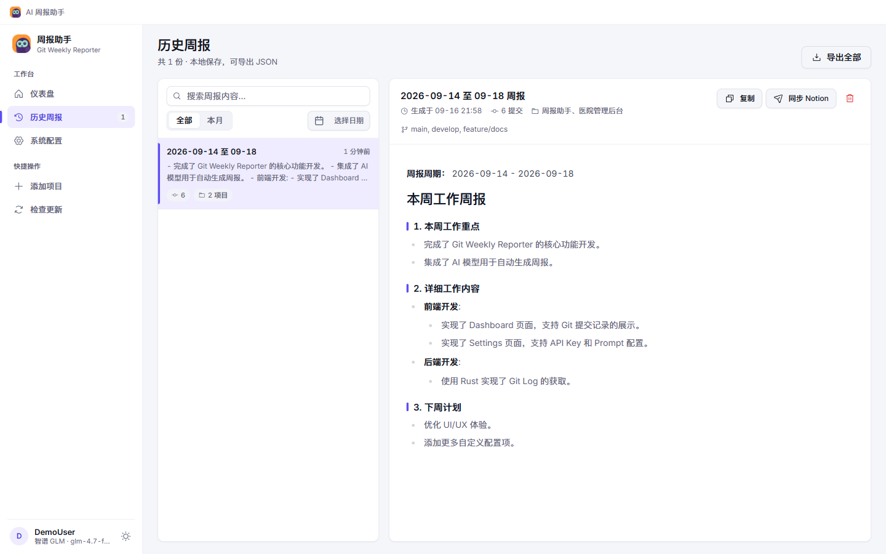

<h2 align="center">Git Weekly Reporter：基于 Git 提交记录的 AI 周报桌面应用</h2>

<p align="center">
  <a href="https://github.com/jiangwanyutao/git-weekly-reporter"></a>
  <a href="https://github.com/jiangwanyutao/git-weekly-reporter/releases/latest"></a>
  
  
  
  <a href="https://github.com/jiangwanyutao/git-weekly-reporter/stargazers"></a>
</p>

<p align="center">
  <a href="https://github.com/jiangwanyutao/git-weekly-reporter/releases/latest"><b>📦 下载最新安装包</b></a>
  &nbsp;|&nbsp;
  <a href="docs/UPDATER_GUIDE.md"><b>📘 发布与自动更新指南</b></a><br>
  安装后应用会自动检查新版本，国内网络可在设置中配置代理地址。
</p>

Git Weekly Reporter 是一款跨平台的 **AI 周报桌面应用**。它读取本地 Git 仓库的提交记录，按 **项目 → 模块 → 功能** 预聚合后交给大模型（智谱 GLM / MiniMax / 任意 OpenAI 兼容厂商），生成一份**给团队和上级看得懂**的结构化周报，并支持历史检索、导出和 Notion 同步。

本仓库是应用的**完整源码与发布入口**：前端位于 `src/`，Tauri 桌面壳位于 `src-tauri/`，GitHub Actions 会在打 tag 时自动构建 Windows / macOS / Linux 安装包并发布更新清单。

## 交流与反馈

使用、模型接入或二次开发遇到问题，欢迎提交 [Issue](https://github.com/jiangwanyutao/git-weekly-reporter/issues)，也欢迎分享提示词模板与周报案例。

## 它用来做什么

写周报最耗时的不是"写"，而是回忆这一周到底做了什么、再把几十条零碎提交翻译成别人听得懂的话。Git Weekly Reporter 把这件事拆成了三步：

在**采集侧**，你只需把本地仓库目录添加为项目，应用会调用系统 `git` 按日期范围拉取提交。每个项目可以单独指定分支范围和作者范围，多项目的提交会合并排序后展示，可逐条勾选或按项目全选，只有勾选的提交才会参与生成。

在**生成侧**，应用不会把原始提交直接丢给模型。提交会先经过噪音过滤（版本号、合并、格式化等）、按模块聚合、按工作量估算条目数，再连同各项目的背景信息（README、package.json 等）一起组装进提示词。生成完成后会做确定性扫描，发现残留的表名、类名、单号等技术词时自动触发一次二次润色，只改写有问题的句子，其余内容保持不变。

在**沉淀侧**，每份周报都会以结构化数据落地本地，可按关键词和日期检索、复制纯文本、导出 JSON，并可选择自动或手动同步到 Notion。

适合的使用场景包括：

- 个人开发者每周汇报，不想再手工翻 `git log`
- 同时维护多个仓库、多个分支，需要把工作合并到一份周报里
- 团队要求周报"说人话"，不能出现代码标识符和内部编号
- 希望把周报沉淀到 Notion 或其他知识库

## 功能特性

**提交采集**

- 项目管理：添加 / 删除本地 Git 仓库，支持项目别名
- 每项目抓取配置：分支范围（全部 / 当前 / 指定，默认全部避免漏提交）和作者范围（继承全局 / 全部 / 指定）
- 提交筛选：按日期范围过滤，多项目合并排序，支持逐条勾选与项目级全选，自动排除 stash 提交

**AI 生成**

- 多模型提供商：内置智谱 GLM、MiniMax，并可添加任意 OpenAI 兼容厂商（自定义名称、协议、API Key、模型、请求地址）
- 提交预聚合：噪音过滤、按模块归组、按工作量分配条目数，避免提交多时变成流水账
- 项目背景注入：自动读取各项目 README / package.json 等作为上下文，并与提交前缀 `[项目名]` 对齐
- 流式输出：推理过程与正文实时展示，生成完成自动入库
- 技术词二次润色：生成后扫描残留的表名、类名、单号等，仅在发现时调用模型定点改写，结构被改坏则自动退回原稿
- 提示词模板库：内置「按功能归并」「按模块分条」「归纳提炼」「基础分类」四套模板，可随时切换或自定义（变量 `{{commits}}`），内置模板随版本更新，自定义内容原样保留

**沉淀与同步**

- 历史管理：关键词搜索、按日期过滤、复制纯文本、导出 JSON
- Notion 同步：生成后自动或手动同步，支持追加正文 / 创建子页面两种方式，长周报按 Notion 单次 100 块上限自动分批
- 代理支持：Notion 同步与更新检查均可配置独立代理地址

**桌面体验**

- 跨平台：Tauri 2 构建，Windows / macOS / Linux 安装包
- 自定义标题栏、亮 / 暗 / 跟随系统三种主题、可拖拽分隔面板
- 自动更新：基于 Tauri updater + GitHub Releases，带进度弹窗

## 系统架构

```text
git-weekly-reporter
├── src                         前端（Vite + React + TypeScript）
│   ├── App.tsx                 路由入口与整体布局
│   ├── pages
│   │   ├── Dashboard.tsx       拉取提交、勾选、生成、润色、结果预览
│   │   ├── Settings.tsx        项目 / 模型 / Notion / 提示词 / 关于
│   │   └── History.tsx         周报历史检索与导出
│   ├── lib
│   │   ├── git.ts              调用系统 git、解析日志、提取项目背景
│   │   ├── commits.ts          噪音过滤、模块聚合、条目估算、技术词扫描
│   │   ├── glm.ts              多提供商流式请求与二次润色
│   │   └── notion.ts           Notion 分批同步
│   ├── store
│   │   ├── index.ts            Zustand 持久化状态
│   │   └── prompt-templates.ts 内置提示词模板库
│   └── components              标题栏、更新弹窗、shadcn/ui 组件
├── src-tauri                   桌面壳（Rust）
│   ├── src/lib.rs              Tauri 命令注册
│   ├── tauri.conf.json         窗口、打包、updater 配置
│   └── capabilities            权限声明（git 执行、文件写入等）
├── docs/UPDATER_GUIDE.md       发布与自动更新指南
└── .github/workflows           tag 触发的三平台构建与发布
```

数据流：`设置页维护项目与模型 → 仪表盘拉取 Git 日志并勾选 → 预聚合 + 项目背景组装提示词 → 流式生成 → 技术词扫描与定点润色 → 落地本地存储 / 同步 Notion → 历史页检索导出`。

Web 模式（`pnpm dev`）下不访问本机 Git，`src/lib/git.ts` 返回 mock 数据，适合调 UI；桌面模式（`pnpm tauri:dev`）才会调用真实 `git` 与系统能力。

## 技术栈

| 维度 | 技术 | 版本 |
|------|------|------|
| 桌面壳 | Tauri | 2.x |
| 前端框架 | React + React Router | 19 / 7 |
| 语言 | TypeScript | 5.8 |
| 构建 | Vite | 7 |
| 状态管理 | Zustand（persist） | 5 |
| UI | shadcn/ui + Tailwind CSS | 3.4 |
| Markdown 渲染 | streamdown / react-markdown | - |
| Git 调用 | @tauri-apps/plugin-shell | 2 |
| 自动更新 | @tauri-apps/plugin-updater | 2 |
| 后端 HTTP | reqwest（rustls） | 0.12 |

## 快速开始

### 安装使用

前往 [Releases](https://github.com/jiangwanyutao/git-weekly-reporter/releases/latest) 下载对应平台安装包。首次启动后：

1. 「设置 → 项目」添加本地 Git 仓库目录，按需配置分支与作者范围
2. 「设置 → 模型」选择提供商并填入 API Key，可点击测试连接
3. 回到仪表盘选择日期范围，拉取提交，勾选后点击生成

### 本地开发

要求：Node.js 20+、pnpm 9+；桌面模式另需 Rust 工具链与 [Tauri 2 前置依赖](https://tauri.app/start/prerequisites/)。

```bash
pnpm install

# Web 模式：仅前端，使用 mock 提交数据，适合调 UI
pnpm dev

# 桌面模式：Tauri + Vite，调用真实 git 与系统能力
pnpm tauri:dev
```

### 构建

```bash
pnpm build          # 类型检查 + 前端产物
pnpm preview        # 预览前端产物
pnpm tauri:build    # 桌面安装包
```

仓库目前没有独立的 lint / test 脚本，类型检查随 `pnpm build` 执行；只做类型检查可运行：

```bash
pnpm exec tsc -p tsconfig.json --noEmit
```

### 发布新版本

1. 同步修改 `package.json`、`src-tauri/tauri.conf.json`、`src-tauri/Cargo.toml` 中的版本号
2. 打 tag 并推送，GitHub Actions 会构建三平台安装包并生成 `latest.json`
3. 更新签名密钥可通过 `pnpm updater:keys` 生成，详见发布指南

## 文档导航

| 文档 | 说明 |
|------|------|
| [发布与自动更新指南](docs/UPDATER_GUIDE.md) | 签名密钥、updater 配置、GitHub Actions 发布流程 |
| [AGENTS.md](AGENTS.md) | 仓库结构与开发约定，供 AI 编码助手使用 |

## 产品预览

### 仪表盘

拉取多项目提交、勾选筛选、流式生成并预览周报。

<p align="center">
  
</p>

<p align="center">
  
</p>

### 设置与历史

| 设置：项目管理与抓取范围 | 设置：提示词模板库 |
|--------------------------|--------------------|
|  |  |

<p align="center">
  
</p>

## 参与贡献

欢迎 Issue 与 Pull Request：

1. Fork 本仓库并创建特性分支
2. 遵循现有分层：Git 与提交处理进 `src/lib`，页面逻辑进 `src/pages`，持久化状态进 `src/store`，桌面能力进 `src-tauri`
3. 提交 PR 并描述变更动机与影响范围
